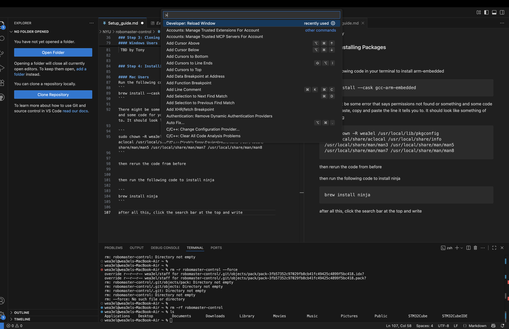
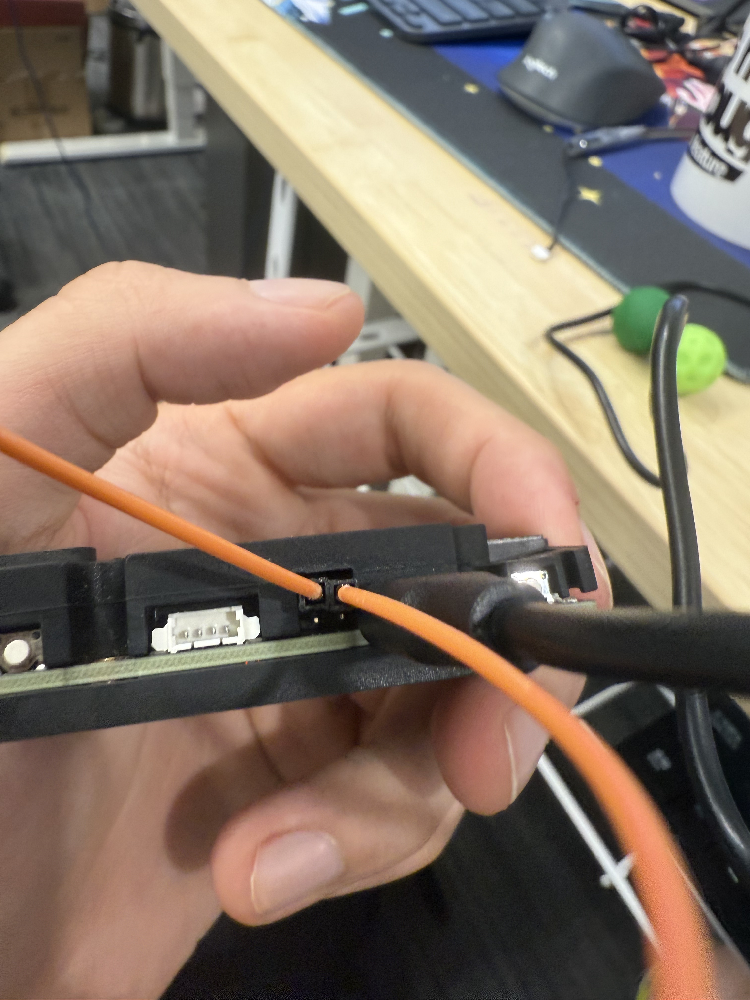
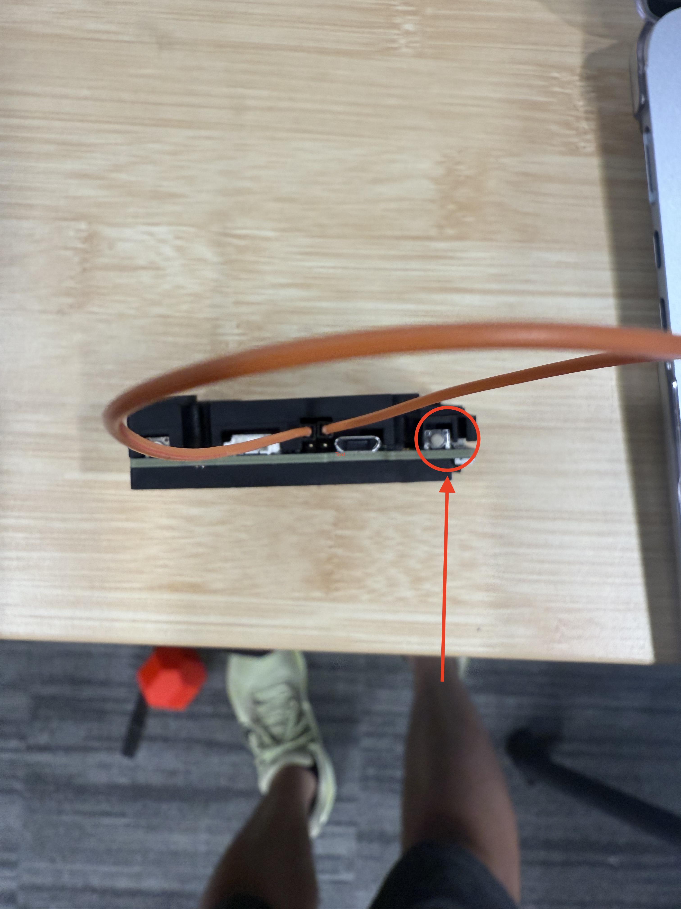
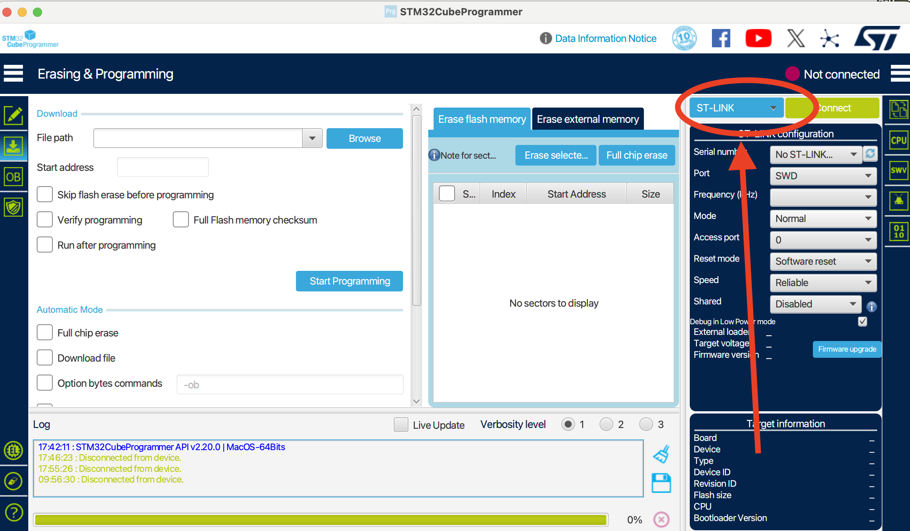
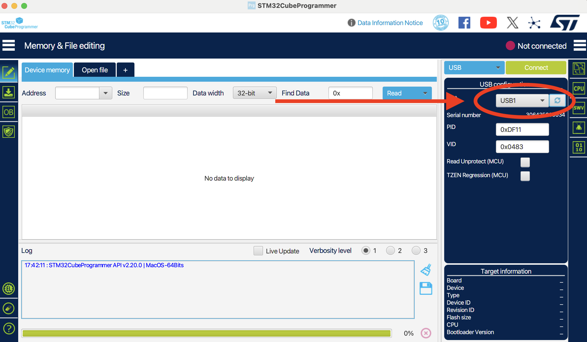
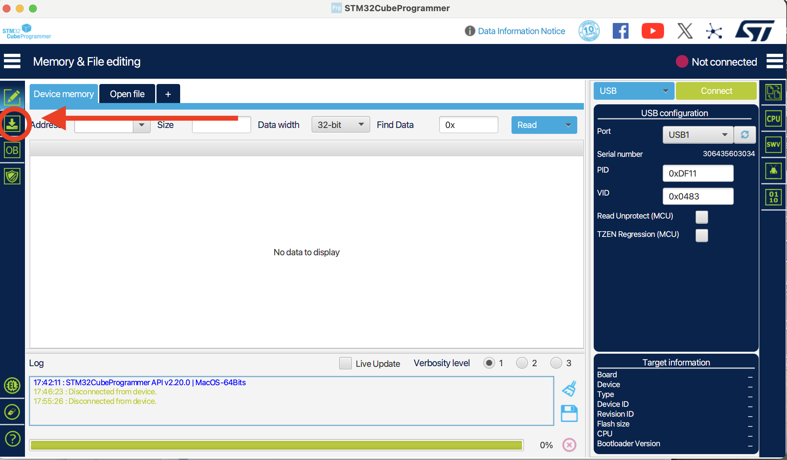
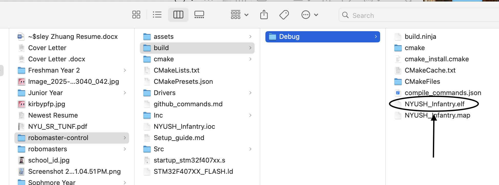
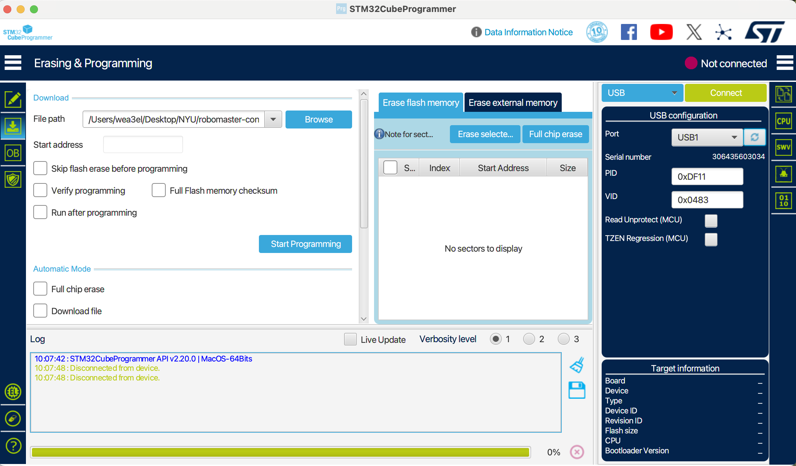
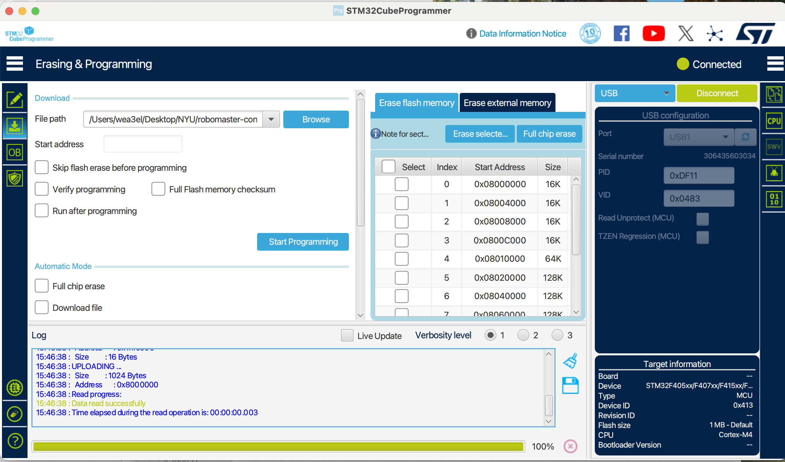

## Sections

1. [**Step 1: Download STMCube Stuff**](#step-1-Download-STMCube-Stuff)
2. [**Step 2: Setup VSCode**](#step-2-setup-vscode)
3. [**Step 3: Cloning from GitHub**](#step-3-cloning-from-github)
4. [**Step 4: Installing Packages**](#step-4-installing-packages)
5. [**Step 5: Flashing Code onto the C Board**](#step-5-flashing-code-onto-the-c-board)


# Step 1: Download STMCube Stuff


Download [**STM32CubeMx**](https://www.st.com/en/development-tools/stm32cubemx.html) and [**STM32CubeProgrammer**](https://www.st.com/en/development-tools/stm32cubeprog.html) for your own machine. If it tells you to sign in just simply make an STaccount. 
# Step 2: Setup VScode

Download [**VScode**](https://code.visualstudio.com/download) for your own machinese (Windows/Mac). 

After it finishes, click to extensions on the left and download Cmake tools and c/c++extensions pack


<p align="center"><sub><strong>Figure 1</strong>: extensions</sub></p>


<p align="center"><sub><strong>Figure 2</strong>: c/c++</sub></p>


# Step 3: Cloning from github 

**PLEASE NOTE THAT THE SETUP FOR THIS PART IS DIFFERENT FOR MAC AND WINDOWS, MAKE SURE TO FOLLOW YOUR SPECIFIC GUIDE**

## MAC Users

Run the following code within the terminal to install homebrew

```
/bin/bash -c "$(curl -fsSL https://raw.githubusercontent.com/Homebrew/install/HEAD/install.sh)"
```

then run the following code to install git commands for github 

```
brew install git
```


<p align="center"><sub><strong>Figure 4</strong>: opening the terminal</sub></p>

Go to the [**Github**](https://github.com/NYUSH-Robotics-Club/robomaster-control) and click code and copy the web-url

then write the following command into the terminal

```
git clone (github url)
```

Follow the directions to clone the repository, if you cannot clone it, please contact one of the leads to invite you into the repository


After that, just open up vscode and open the folder and you should be able to see the following screen with the code


<p align="center"><sub><strong>Figure 5</strong>: code page</sub></p>

Click [**here**](github_commands.md) for more github commands that we will be using


## Windows Users

 TBD by Tony


# Step 4: Installing Packages

**AGAIN THIS PART IS DIFFERENT FOR MAC AND WINDOWS**
## Mac Users
Run the following code in your terminal to install arm-embedded
```
brew install --cask gcc-arm-embedded
```

There might be some error that says permissions not found or something and some code for you to paste, copy and paste the line it tells you to. It should look like something of the following

```
sudo chown -R wea3el /usr/local/lib/pkgconfig /usr/local/share/aclocal /usr/local/share/info /usr/local/share/man/man3 /usr/local/share/man/man5 /usr/local/share/man/man7 /usr/local/share/man/man8
```

then rerun the code from before


then run the following code to install ninja

```
brew install ninja
```

after all this, click the search bar at the top and write

```
>Developer: Reload Window
```




<p align="center"><sub><strong>Figure 6</strong>: reload</sub></p>

and you should be able to see a little build button at the bottom


<p align="center"><sub><strong>Figure 7</strong>: build</sub></p>

once you click the build button, just click the debug option and you should be allllll good

# Step 5: flashing code onto the C Board


Take a Robomaster C board, and connect the C board to your computer using a usb wire. 


<p align="center"><sub><strong>Figure 8</strong>: connecting board to computer</sub></p>

Once you have connected the board, take a breadboard wire and insert it into the top two pins of boot and click the RST button on the right. 



<p align="center"><sub><strong>Figure 9</strong>: switch to boot</sub></p>



<p align="center"><sub><strong>Figure 10</strong>: RST button</sub></p>

Open up STM32CubeProgrammer, at the top right, click ST-Link and change it to USB. 



<p align="center"><sub><strong>Figure 11</strong>: Change to USB</sub></p>


Once you have done so, you should now see a USB1 there, if not, click the refresh button next to it. 



<p align="center"><sub><strong>Figure 12</strong>: USB1 Connect</sub></p>

After this, please click the erasing and programming button on the left, and swithc the file to the **.elf file** that was generated in robomasters/build/debug



<p align="center"><sub><strong>Figure 13</strong>: cswtich to erasure and programming</sub></p>



<p align="center"><sub><strong>Figure 14</strong>: choose elf file</sub></p>


Click the connect light on the top right, the not connected sign will change from red to green and from not connected to connected



<p align="center"><sub><strong>Figure 15</strong>: connect to board</sub></p>

Finally, click programming, and you are alll good! Congrats :D



<p align="center"><sub><strong>Figure 15</strong>: program to board</sub></p>

