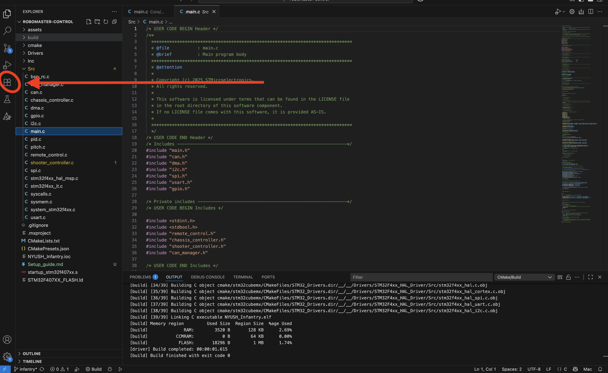
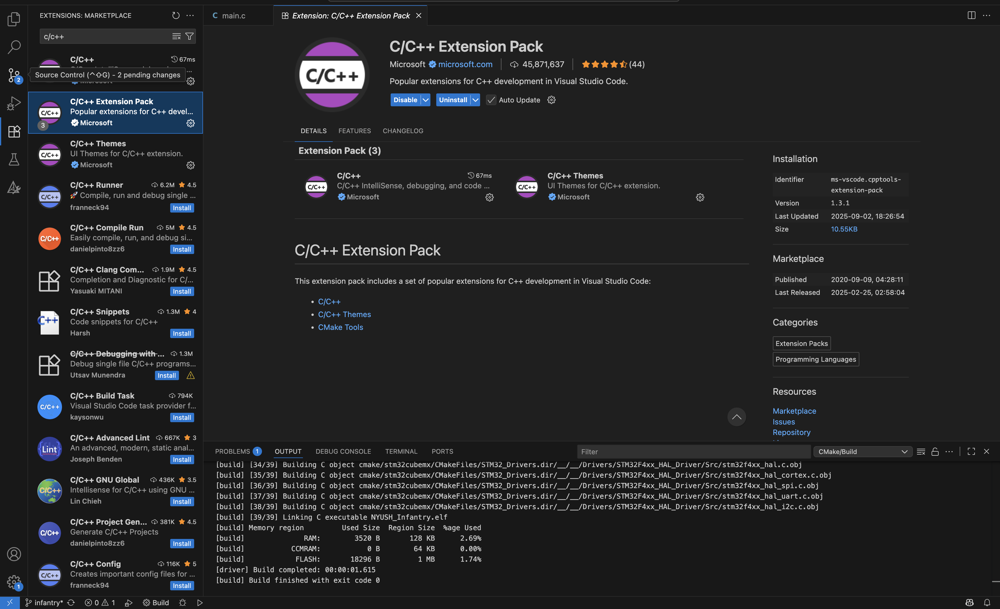
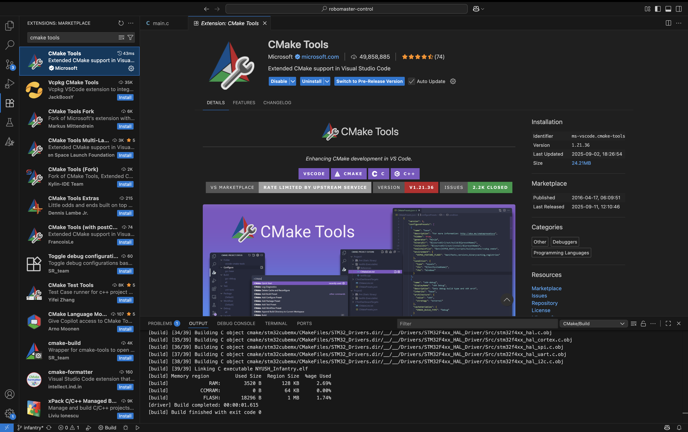
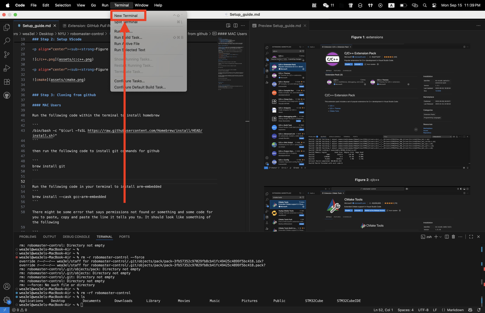
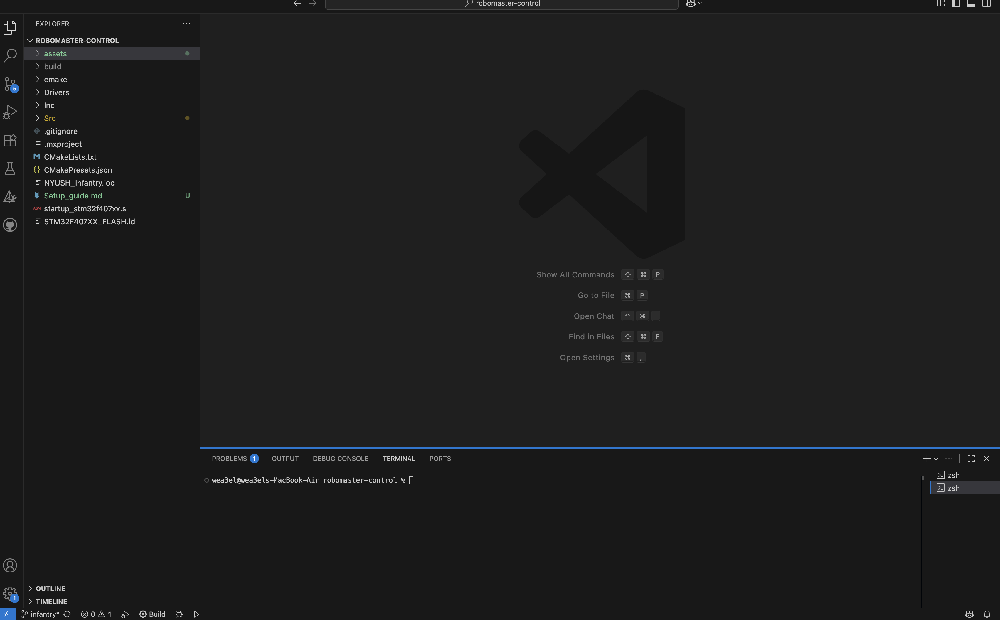
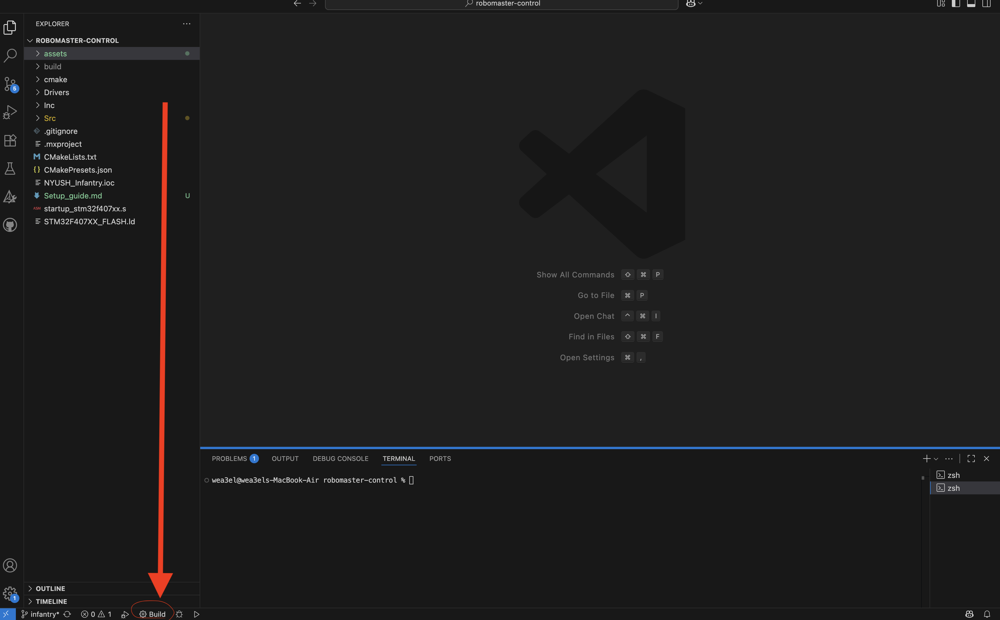

### Sections

1. [**The Unit Circle**](#circle)
2. [**Collision detection theory**](#collision)
    1. [**Circle-to-circle collisions**](#circle-to-circle)
    2. [**Point-to-circle collisions**](#point-to-circle)
    3. [**Box-to-box collisions**](#box-to-box)
    4. [**Point-to-box collisions**](#point-to-box)

mac上装cubemx，cubeprogrammer，vs code里装cmake tools，c/c++ extensions pack, 最后brew install --cask gcc-arm-embedded，然后vs code命令行里点build，build好用programmer烧录


### Step 1: Download STMCube Stuff


Download [**STM32CubeMx**](https://www.st.com/en/development-tools/stm32cubemx.html) and [**STM32CubeProgrammer**](https://www.st.com/en/development-tools/stm32cubeprog.html) for your own machine. If it tells you to sign in just simply make an STaccount. 
### Step 2: Setup VScode

Download [**VScode**](https://code.visualstudio.com/download) for your own machinese (Windows/Mac). 

After it finishes, click to extensions on the left and download Cmake tools and c/c++extensions pack



<p align="center"><sub><strong>Figure 1</strong>: extensions</sub></p>



<p align="center"><sub><strong>Figure 2</strong>: c/c++</sub></p>




### Step 3: Cloning from github 

#### MAC Users

Run the following code within the terminal to install homebrew

```
/bin/bash -c "$(curl -fsSL https://raw.githubusercontent.com/Homebrew/install/HEAD/install.sh)"
```

then run the following code to install git commands for github 

```
brew install git
```




<p align="center"><sub><strong>Figure 4</strong>: opening the terminal</sub></p>

Go to the [**Github**](https://github.com/NYUSH-Robotics-Club/robomaster-control) and click code and copy the web-url

then write the following command into the terminal

```
git clone (github url)
```

Follow the directions to clone the repository, if you cannot clone it, please contact one of the leads to invite you into the repository


After that, just open up vscode and open the folder and you should be able to see the following screen with the code




<p align="center"><sub><strong>Figure 5</strong>: code page</sub></p>

Click [**here**](github_commands.md) for more github commands that we will be using


#### Windows Users

 TBD by Tony


### Step 4: Installing Packages

#### Mac Users
Run the following code in your terminal to install arm-embedded
```
brew install --cask gcc-arm-embedded
```

There might be some error that says permissions not found or something and some code for you to paste, copy and paste the line it tells you to. It should look like something of the following

```
sudo chown -R wea3el /usr/local/lib/pkgconfig /usr/local/share/aclocal /usr/local/share/info /usr/local/share/man/man3 /usr/local/share/man/man5 /usr/local/share/man/man7 /usr/local/share/man/man8
```

then rerun the code from before


then run the following code to install ninja

```
brew install ninja
```

after all this, click the search bar at the top and write

```
>Developer: Reload Window
```

and you should be able to see a little build button at the bottom




<p align="center"><sub><strong>Figure 6</strong>: build</sub></p>

once you click the build button, just click the debug option and you should be allllll good

### Step 5: flashing code onto the C Board

